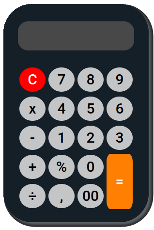

# Calculator

Projeto tem a ideia de sintetizar todo conhecimento que obtive,
sem usar tutoriais, apenas minha lógica e documentação como da Mozila.
Provalvemente o codigo está com erros ou longo demais, a ideia é ir atualizando conforme aprendo mais sobre.

Requisitos:
Fazer uma calculadora simples, que consiga executar funções de soma,subtração, multiplicação, divisão e porcentagem.
 Feito em HTML,CSS e Javascript vanilha.
 

- CONCLUIDO:
    - [X] Adição
    - [x] Subtração
    - [x] Multiplicação
    - [x] Divisão
    - [ ] Porcentagem

- Melhorias:
    - [x] Clean code
    - [ ] Apagar resultado ao pressionar somente um numero sem um operador antes
    - [ ] Css

- Obervações:

Inicialmente o projeto tinha 200 linhas, dimuido para 130, e atualmente 47 linhas. A quantidade de linhas não reflete
diretamente a um código melhor, porém neste caso foi, e obtive uma evolução pessoal de racicionio lógico , e muito consumo de documentação,
mostrando a efetividade de conhecer metodos para deixar o código bem menor e ter o mesmo resultado.
Pretendo melhorar o css dela e também finalizar os requisitos acima não tickados.